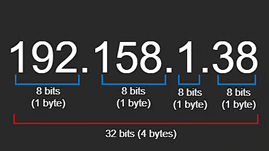

# 🌐 What is a Network?

In this example, we use **Alice (Client)** and **Bob (Server)** to explain networking concepts.

Alice and Bob live in different parts of the country. Alice wants to invite Bob to her birthday party, so she creates an invitation and sends it. This is similar to how devices communicate over a network using **IP addresses**.

---

## 📌 IP Address
An **IP address** is a unique numeric identifier for a device on a network.

- **IPv4**: 32-bit (e.g., `192.168.1.1`), supports ~4.3 billion addresses.
- **IPv6**: 128-bit (e.g., `2001:db8::ff00:42:8329`), provides a vast address space.

Bob's mailing address is like his **IP address**, and Alice's invitation is like a **data packet**.

---

## 📦 Protocols for Sending Data

### ✉️ IP (Internet Protocol) & Data Packets
Data is transferred as **packets**, which contain:
- **Header** (Source/Destination IP)
- **Payload** (Actual Data)
- **Trailer**

Packets may arrive out of order, requiring **TCP** for proper sequencing.

### 🔄 TCP (Transmission Control Protocol)
- Ensures **data integrity** and **correct order**.
- Works like **page numbers** in a letter, allowing Bob to read Alice’s message in sequence.

---

## 🔄 Network Layers
Networking follows a **layered architecture**:
1. **Application Layer** (HTTP) → Handles web communication.
2. **Transport Layer** (TCP) → Ensures reliable delivery.
3. **Network Layer** (IP) → Determines routing paths.

---

## 🌍 Public vs Private Networks
- **Public IP**: Unique, assigned by ISPs, accessible over the internet.
- **Private IP**: Used in local networks (e.g., home Wi-Fi).

---

## 🔄 Static vs Dynamic IP Addresses
- **Static IP**: Fixed, manually assigned, used by servers.
- **Dynamic IP**: Changes periodically, commonly used by clients.

---

## 🎯 Ports & Applications
A **port** identifies network services on a device.
- **Port 80** → HTTP
- **Port 443** → HTTPS
- **Port 4200** → Angular Development Server

Example: A frontend and backend app must run on **different ports** to avoid conflicts.

---

🚀 **Summary**
- Devices communicate using **IP addresses**.
- **TCP/IP** ensures **reliable data transmission**.
- **Public/Private IPs** manage network access.
- **Ports** differentiate multiple applications.

Understanding these basics helps developers work efficiently with networks! 🔥

# 📡 TCP vs UDP

## 🛠️ The Use Cases for TCP
Previously, we introduced **TCP (Transmission Control Protocol)** and its key features. Now, let's explore TCP in more depth and introduce **UDP (User Datagram Protocol)**.

TCP and UDP serve different purposes in **data transmission**. When data is sent, it is broken into packets. Some packets may get lost in transit. **TCP ensures reliable delivery** by establishing a **3-way handshake** before any data exchange.

### 🔄 TCP Features:
- **Connection-Oriented** → Establishes a two-way connection before transmitting data.
- **Reliable Delivery** → Ensures all packets arrive correctly; resends lost packets.
- **Acknowledgment System** → Requires confirmation of received packets.
- **Error Handling** → Reorders out-of-sequence packets.

### 📌 TCP Use Cases:
- **Web Browsing (HTTP, HTTPS)** → Ensures reliable page loads.
- **Email (SMTP, IMAP, POP3)** → Prevents missing or corrupted messages.
- **File Transfers (FTP, SFTP)** → Ensures complete and error-free downloads.
- **Remote Access (SSH, Telnet)** → Secure, uninterrupted sessions.

---

## 🚀 The Use Cases for UDP
While **TCP prioritizes reliability**, **UDP focuses on speed**. **UDP does not**:
- Reorder packets.
- Resend lost packets.
- Require an acknowledgment system.

This makes UDP **faster and more efficient** for real-time applications where missing packets **don’t significantly impact user experience**.

### ⚡ UDP Features:
- **Connectionless** → No handshake; starts transmitting immediately.
- **Low Overhead** → No acknowledgment or retransmission.
- **Faster Transmission** → Prioritizes speed over reliability.

### 📌 UDP Use Cases:
- **Live Streaming (Video, Audio, VoIP)** → Missing a frame is better than buffering.
- **Online Gaming** → Lag reduction is more important than perfect packet delivery.
- **DNS (Domain Name System)** → Quick lookups without waiting for confirmations.
- **IoT (Internet of Things)** → Fast updates over unreliable networks.

---

## 🆚 TCP vs UDP: Quick Comparison

| Feature           | TCP (Transmission Control Protocol) | UDP (User Datagram Protocol) |
|------------------|---------------------------------|----------------------------|
| **Connection**   | Connection-Oriented (3-way handshake) | Connectionless |
| **Reliability**  | Ensures all packets arrive; retransmits lost packets | No guarantee of delivery |
| **Speed**        | Slower due to acknowledgment and retransmission | Faster, minimal delay |
| **Overhead**     | High (error checking, retransmission, ordering) | Low (just sends data) |
| **Use Cases**    | Web browsing, email, file transfer | Streaming, gaming, VoIP |

---

## 🎯 Summary
- **TCP** ensures reliability but has higher latency.
- **UDP** prioritizes speed but may result in packet loss.
- The choice between TCP and UDP depends on **application requirements**.

Understanding the trade-offs between **speed and reliability** helps developers choose the right protocol for the job! 🚀
# 🌍 Domain Name System (DNS)

## 📖 What is DNS?
DNS functions like the **internet’s phone book**, translating human-friendly domain names (e.g., `google.com`) into machine-readable **IP addresses** (e.g., `142.251.211.238`).

Instead of memorizing IP addresses, users rely on DNS to route requests to the correct servers.

### 🏛️ ICANN & Domain Name Registrars
The **Internet Corporation for Assigned Names and Numbers (ICANN)** manages DNS operations but does not directly sell domain names.

- **ICANN** → Governs domain name policies.
- **Domain Registrars** (e.g., GoDaddy, Google Domains) → Sell and manage domain registrations.

📌 **Analogy**:
- **ICANN** is like a shopping mall owner.
- **Domain Registrars** are like individual store lease providers.

---

## 🗂️ DNS Records
DNS records store important information about a domain. The most common record is the **A (Address) Record**, which maps a domain to an **IPv4 address**.

Example:
- `neetcode.io → 192.158.1.39`
- A DNS lookup helps direct requests to the right server.

To **speed up future requests**, devices cache DNS records instead of querying the DNS server repeatedly.

---

## 🔗 Anatomy of a URL (Uniform Resource Locator)
Example:  
`https://domains.google.com/get-started`

| Component | Description |
|-----------|------------|
| **Protocol (Scheme)** | Defines how to communicate (`https://`, `ftp://`, `ssh://`). |
| **Domain Name** | `domains.google.com` – Includes subdomain, primary domain, and top-level domain (TLD). |
| **Path** | `/get-started` – A specific section within the website. |
| **Port (Optional)** | If using a **non-standard port**, it must be specified (e.g., `localhost:8080`). |

### 🛜 Protocols in URLs:
- **HTTP/HTTPS** → Web browsing.
- **FTP (`ftp://`)** → File transfer between systems.
- **SSH (`ssh://`)** → Secure remote connections.

---

## 🌐 Domain Name Structure
Example: `domains.google.com`

| Component | Description |
|-----------|------------|
| **Subdomain** | `domains` – A separate section within the main website. |
| **Primary Domain** | `google` – The core identity of the website. |
| **Top-Level Domain (TLD)** | `.com` – Represents the website category (e.g., `.io`, `.org`). |

---

## 🚀 Ports in URLs
By default:
- **HTTP** uses **port 80**.
- **HTTPS** uses **port 443**.

If using a **non-standard port**, it must be included in the URL (e.g., `localhost:8080`).

---

## 🎯 Summary
- **DNS** translates domain names into IP addresses.
- **ICANN** manages domain policies, while **registrars** sell domain names.
- **DNS records** map domains to servers.
- **URLs** contain **protocols, domains, paths, and ports**.
- **Caching DNS records** improves performance.

Understanding DNS is fundamental for **system design, web development, and network architecture**! 🚀

# 🌐 HTTP (Hypertext Transfer Protocol)

## 📡 Client-Server Model
- **Client** → Requests services (e.g., web browser, mobile app).
- **Server** → Responds with resources (e.g., web pages, data).
- **Peer-to-Peer (P2P)** → Some systems act as both **client and server**.

---

## 🔗 Remote Procedure Calls (RPC)
RPC enables a **program to execute functions on a remote server**.
Example:  
When searching for **"NeetCode"** on YouTube, the browser calls YouTube's server, which processes the request and returns relevant videos.

---

## 📨 What is HTTP?
- **Built on top of IP and TCP.**
- **Request/Response Protocol** → Defines rules for data exchange.
- **Used in web browsing, APIs, and network communication.**

### 🔎 HTTP in Browser Developer Tools
- Open **Developer Tools** (`Inspect > Network Tab`) to monitor network requests.
- **HTTP/3 (h3)** is the latest protocol version, ensuring **faster and more secure** communication.

---

## 📥 Anatomy of an HTTP Request
| Component          | Description |
|-------------------|------------|
| **Method**        | GET, POST, PUT, DELETE (CRUD operations). |
| **URL/URI**       | Location of the requested resource. |
| **Headers**       | Extra metadata (e.g., content type, cookies). |
| **Body**          | Data sent with POST/PUT requests. |

---

## 🔄 HTTP Methods
| Method  | Purpose |
|---------|---------|
| **GET**    | Retrieve data (idempotent). |
| **POST**   | Create new resource (not idempotent). |
| **PUT**    | Update resource (idempotent). |
| **DELETE** | Remove resource (idempotent). |

---

## 📊 HTTP Status Codes
| Code  | Meaning |
|-------|---------|
| **1xx** | Informational (Request received, processing). |
| **2xx** | Success (e.g., `200 OK`, `201 Created`). |
| **3xx** | Redirection (e.g., `301 Moved Permanently`). |
| **4xx** | Client errors (e.g., `400 Bad Request`, `401 Unauthorized`). |
| **5xx** | Server errors (e.g., `500 Internal Server Error`). |

---

## 🔒 SSL/TLS & HTTPS
- **HTTPS** = **HTTP + TLS (Transport Layer Security)** for **secure** communication.
- Protects against **man-in-the-middle (MITM) attacks**.
- Ensures **data integrity and encryption**.

🚀 **Key Takeaway**: Always use **HTTPS** for secure communication.
# 🔌 WebSocket: Real-Time Communication Protocol

## 🌐 Application-Level Protocols
Common application-level protocols include:
- **HTTP, WebSocket, FTP, SMTP, SSH, and WebRTC**.
- Most use **TCP**, except **WebRTC**, which relies on **UDP**.

---

## ❌ The Problem with HTTP for Real-Time Communication
- **HTTP is unidirectional** → Client sends a request, server responds.
- **Polling** (repeatedly checking for updates) is inefficient:
  - Too frequent → Wastes resources.
  - Too infrequent → Delays real-time updates.
- Not ideal for chat apps, live streaming, or online gaming.

---

## ✅ WebSocket: The Solution
**WebSocket enables two-way, real-time communication between client and server**.
- Efficient → **No need for continuous polling**.
- Ideal for **chat apps, live streaming, gaming**.

---

## 🔄 Establishing a WebSocket Connection
1️⃣ **Client initiates a WebSocket handshake** → Sends an HTTP Upgrade request.  
2️⃣ **Server responds with `101 Switching Protocols`** → Confirms WebSocket connection.  
3️⃣ **Bi-directional communication starts** → Both client and server send data in real-time.  

### 🔧 Default Ports:
- **WS (WebSocket):** Port **80** (same as HTTP).
- **WSS (WebSocket Secure):** Port **443** (same as HTTPS).

🚨 **Firewall Considerations**: Some networks may block WebSockets.

---

## 🔍 WebSocket vs. HTTP/2
- **HTTP/2** supports multiplexing (multiple requests on a single connection).
- **WebSocket** still remains **better for real-time, bidirectional communication**.

---

## 🚀 Key Takeaways
- **WebSocket enables real-time, two-way communication**.
- **Better than HTTP polling for live applications**.
- **Uses standard web infrastructure and widely supported**.

Understanding WebSockets is **essential** for modern web development! 🔥

### CDNs
CDN là hệ thống các máy chủ phân phối nội dung đến người dùng dựa trên vị trí địa lý gần nhất.
Nó giúp tăng tốc độ tải, giảm tải cho server gốc, cải thiện bảo mật và khả năng mở rộng hệ thống.

### DNS store cache ở đâu
DNS cache là bộ nhớ tạm lưu các bản ghi phân giải tên miền (domain name) sang địa chỉ IP. DNS cache có thể nằm ở nhiều nơi trên đường truy vấn DNS, gồm:

1. Trên máy người dùng (client):

- Hệ điều hành hoặc trình duyệt lưu lại các bản ghi DNS từng truy vấn để tăng tốc truy cập lần sau.

2. Trên router/gateway cục bộ:

- Nhiều router hoặc modem lưu cache DNS để giảm số lượng truy vấn ra ngoài Internet.

3. Trên DNS server của nhà mạng hoặc DNS server trung gian (resolver):

- Máy chủ DNS trung gian (của ISP, Google DNS, Cloudflare…) giữ cache để trả lời nhanh cho các truy vấn trùng lặp từ nhiều người dùng.

4. Trên các server DNS phân cấp trên Internet:

- Các DNS server cao hơn cũng có thể cache tạm thời nhưng chủ yếu cache ở cấp resolver.
